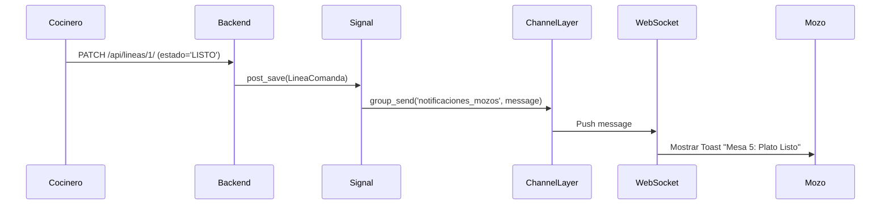

# Design: Arquitectura de Notificaciones WebSockets

## Componentes

### 1. Backend: Django Channels & Daphne
- **Consumer**: `NotificationConsumer` manejará la conexión WebSocket. Se suscribirá al grupo `notificaciones_mozos`.
- **Protocolo**: `ws://` (WebSocket).
- **Mensaje JSON**:
  ```json
  {
    "type": "comida_lista",
    "mesa": "5",
    "cliente": "Sleyter Correa",
    "plato": "Ceviche"
  }
  ```

### 2. Disparador (Trigger)
Utilizaremos un **Signal de Django** (`post_save`) sobre el modelo `LineaComanda`.
- **Condición**: Si `instance.estado == 'LISTO'` y el estado anterior NO era listo.
- **Acción**: Obtener la mesa y el cliente de la comanda y enviar el mensaje al `ChannelLayer`.

### 3. Frontend: Alpine.js Global Listener
- Se ubicará en `templates/base.html` para estar disponible en todas las pantallas.
- Usará el API nativa `WebSocket`.
- Al recibir un mensaje, disparará un evento personalizado de Alpine o mostrará un Toast directamente.

## Decisiones de Diseño
- **Channel Layer**: Se usará `InMemoryChannelLayer` para evitar la dependencia de Redis en esta fase inicial, permitiendo que funcione con `python manage.py runserver` (Daphne).
- **Seguridad**: Solo usuarios autenticados podrán conectarse al WebSocket.
- **Toasts**: Se integrará un sistema de Toasts minimalista en `base.html`.

## Diagrama de Secuencia

